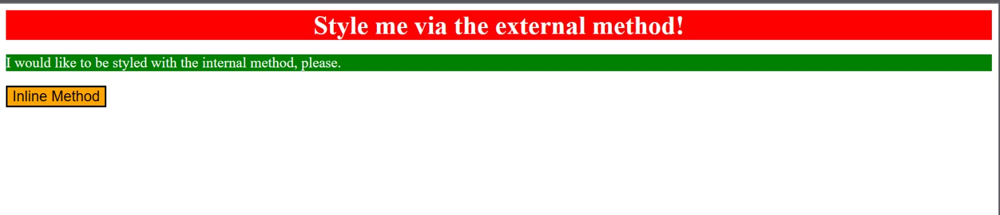

# Methods for Adding CSS

In this exercise, I'm going to practice adding CSS to an HTML file using the external CSS method.

## The properties need to add to each element are:

- `div`: a red background, white text, a font size of 32px, center aligned, and bold
- `p`: a green background, white text, and a font size of 18px
- `button`: an orange background and a font size of 18px

# Desired Outcome

### Self Check

- I did use all three methods of adding CSS to an HTML file.
- I did  properly link the external CSS file in the HTML file.
- I did the div element have CSS added via the external method.
- I did  the p element have CSS added via the internal method.
- I did  the button element have CSS added via the inline method.
